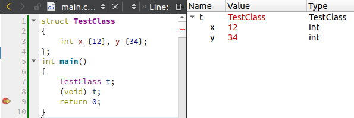

## Qt (C++): QtCreator Debug Helpers - “Hello World” Example

### Python Debug Helpers Example

Link: https://stackoverflow.com/questions/60351620/

## Question

I'm trying to get started using [debug helpers in QtCreator][1].

But I can't even get anything simple to work.

I made this simple python file:

```python
from dumper import *

def qdump_TestClass(d, value):
    d.putNumChild(0)
    d.putValue("hi")
```

Then add that file in here:

[![enter image description here][2]][2]

This is the C++ definition of the class:
```cpp
struct TestClass {
    int x, y;
};
```

I have been following the steps in [this other question][3]. But that didn't work for me.


  [1]: https://doc.qt.io/qtcreator/creator-debugging-helpers.html#debugging-helper-overview
  [2]: https://i.stack.imgur.com/LTpRk.png
  [3]: https://stackoverflow.com/questions/34354573/how-to-write-a-debugging-helper-for-qtcreator

---

## Answer

Use double underscores in function name:

    def qdump__TestClass(d, value):
             ^^

And, correct your path according to the documentation:

    ~/<Qt>/Tools/QtCreator/share/qtcreator/debugger/personaltypes.py

Use your Qt folder name (or path if it's not at `~`).

The path showing in that dialog box is relative to your `app`.

Here's a complete working example:

#### [main.cpp](test-project/main.cpp)

```cpp
struct TestClass
{
    int x {12}, y {34};
};

int main()
{
    TestClass t;
    (void) t;
    return 0;
}
```

#### [personaltypes.py](personaltypes.py)

```python
from dumper import *

def qdump__TestClass(d, value):
	d.putValue("TestClass")
	d.putNumChild(2)
	if d.isExpanded():
		with Children(d):
			d.putSubItem("x", value["x"])
			d.putSubItem("y", value["y"])
```
Snapshot:



---
